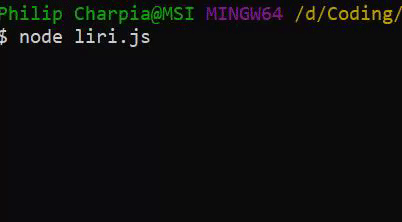

# liri-node-app

### App Overview

This app was created as a homework assignment for the UNCH Coding Bootcamp in week 11 of the program.

This app utilizes node Inquirer to request user input.
Initial user input directs the program to run one of four functions, requiring additional query data from the user to direct the functions.

