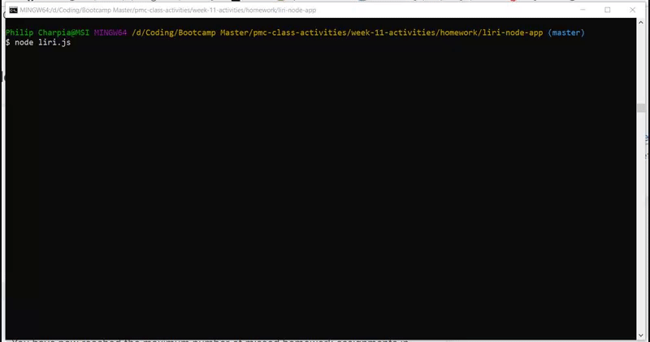

## App Overview

LIRI is a _Language Interpretation and Recognition Interface_, inspired by SIRI.

This app was created as a homework assignment for the UNCH Coding Bootcamp in week 11 of the program. The assignment focuses on the use of node.js.

### Technologies Used

    1. Node.js

    2. npm Inquirer

    3. npm Axios

    4. npm Moment

    5. npm DotEnv

    6. npm Node-Spotify-API

### API Calls

    1. Spotify

    2. OMDB

    3. Bands in Town

### Setup

    1. Clone the repo from GitHub.

    2. The user will need to aquire API keys for Spotify, Bands in Town, and OMDB.

    3. The user will need to create a .env file in the root directory to fill in their API keys in the following format:

        SPOTIFY_ID=value
        SPOTIFY_SECRET=value

        BANDS_ID=value

        OMDB_KEY=value

    4. In the command prompt navigate to the root folder and run `npm install` to obtain all of the necessary node modules listed in the `package.json`.

### Use

    1. Use the command prompt navigated to the root folder to run `liri.js`.

    2. This app utilizes node Inquirer to request user input. Initial user input directs the program to run one of four functions.

    3. Afterwards requiring additional query data from the user to direct the functions. Query data then runs the appropriate API search and returns data.

 

    4. The returned data is pushed into the `log.txt` file as a pseudo-database for previous searches.